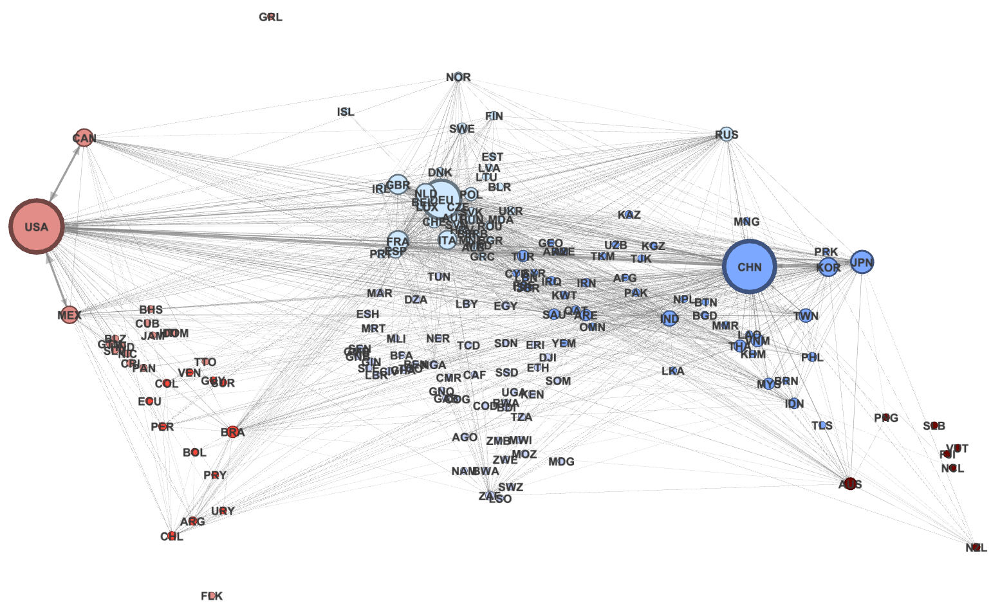
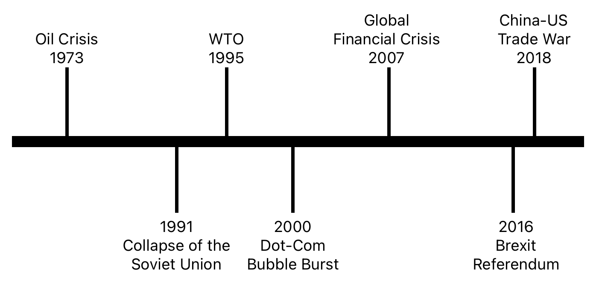
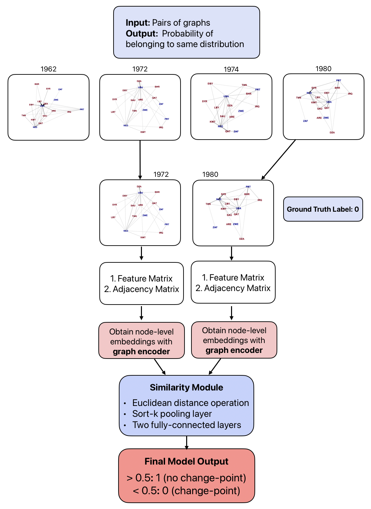

# Trade-GNN-Thesis
- **Primary research objective:** Can graph machine learning be used to better predict economic shocks in the international trade network (ITN) compared to traditional change-point detection methods?
- **Secondary research objective:** How do the detected economic shocks differ by region sub-networks?

## Overview

This project explores the use of **Siamese Graph Neural Networks (Siamese-GNNs)** for detecting change-points in economic systems, specifically within the context of international trade networks. By leveraging graph-based approaches, the model analyzes shifts in the underlying structure of the trade network and identifies economic shocks that impact trade flows. This work further explores how this type of model could be used to identify how regions might be differentially impacted by economic shocks. This work is still in progress and the eventual goal is to use this method to understand how tariffs specifically manifest themselves as economic shocks.

## Key Concepts
  
- **Graph Neural Networks (GNNs):** A class of neural networks designed to process data represented as graphs. GNNs can capture complex relationships in networks by passing messages between nodes and aggregating information from their neighbors.

- **Siamese-GNN:** A type of GNN that can take as input two networks and output a measure of their similarity.
  
- **Change-Point Detection:** A time-series method of identifying years where the properties of a time series change. In this case, it identifies shifts in the international trade network that could represent economic shocks.

- **Economic Shocks:** This work uses a set of economic shocks considered to be global events. These include, financial crises, geopolitical events, tariffs, and trade agreements.

## Approach

1. **Data Collection and Preprocessing:**
   - Data was collected from publicly available WTO trade data collected and cleaned by the Harvard Growth Lab, focusing on bilateral trade data between countries over the years 1962-2018.
   - The data is represented as graphs, where nodes represent countries, and edges connect country A that exports to country B. The edge weights are the proportion of country A's exports that are sent to country B.
   - Preprocessing includes creating the trade networks using the trade data, incorporating the World Bank features, and normalizing the data.

2. **Model Design:**
   - The Siamese-GNN model was designed to compare two graphs from different time periods and determine if they belong to the same period or if a change-point has occurred.
   - The network utilizes GNN layers to encode graph structures and Siamese network architecture to compare two graphs by computing a similarity score.
   - Binary cross entropy was used as the loss function to minimize the difference between the embeddings of similar graphs and maximize the difference for dissimilar graphs.
   

3. **Training and Evaluation:**
   - The model was trained using historical trade data, with the true change-points labeled using domain knowledge of global economic shocks.
   - Pairs of networks from two years are labeled as 0 if they are separated by an economic shock (not belonging to the same distribution) or 1 if they are not (belong to same distribution).
   - GCN, GraphSAGE, GAT, and GIN encoders were tested.
   - Performance was evaluated using standard metrics such as precision, recall, and F1 score.
   - Cross validation was performed and hyperparameters were tuned.

4. **Change-Point Detection**
   - Once the models were trained, the best models were selected to identify the change-point years on the test graphs.
   - The change-point detection involves converting the similarity scores into a list of years. This is done by selecting the indices where the similarity score drops below 0.5. Similarity scores are averaged across three year windows to reduce noise. 
   - Change-points were also detected using traditional network metrics to act as a baseline.

4. **Analysis:**
   - Subnetworks of regions were then analyzed to understand how these are differentially impacted by economic shocks, with significant differences found.

## Findings
Overall, this project finds a significant increase in predictive power with the use of S-GNNs. While the best performing traditional network distance measure achieves an F1 of 0.15 and an ARI of 0.40, the S-GNN models consistently achieve scores for both metrics above 0.90.

Additionally, change-points do vary by region subnetwork and possibly represent region-specific events, indicating this method could be useful for economic analysis.

## Primary Folders and Files
1. **SRC** 
   - detect.py: calculates the change-point years using the trained model on the set of test pairs
   - get_train_pairs.py: creates the sets of train/val/test graphs to be used in training/evaluation
   - model.py: contains the Siamese-GNN model
   - train.py: trains the Siamese-GNN
   - Utils: helper functions for network distances, metrics, sampling, etc.
2. **Notebooks**
   - create_graphs.ipynb: creates a graph for each year and exports to graphs_gdp file
   - change_point_detection.ipynb: graphs the detected change-points from both the traditional and S-GNN methods
   - create_features_dict.ipynb: creates the networks with node features from different feature selection methods
   - region-subnetwork-analysis.ipynb: creates the region sub-networks and graphs their detected change-points
